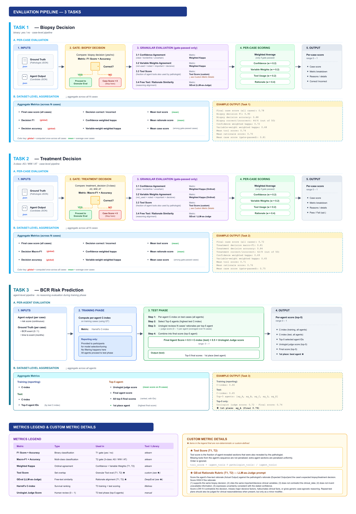

# LLM Biopsy Decision Evaluator

Evaluates LLM-agent biopsy-decision form responses against pathologist
ground-truth using a hybrid deterministic + LLM scoring pipeline.


---

## Repo layout

```
.
├── evaluate.py                      # main evaluation script
├── Makefile                         # entry point: `make run`
├── .env.example                     # configuration template → copy to .env
│
├── docker/
│   ├── Dockerfile                   # eval container (Python 3.11, no GPU needed)
│   ├── docker-compose.yml           # two-service stack: ollama + eval
│   └── requirements.txt             # Python dependencies
│
├── mimic_datasets/
│   ├── target.json                  # ground-truth pathologist responses (15 cases)
│   ├── evaluation_object.json       # LLM-agent responses to evaluate (15 cases)
│   └── README.md                    # dataset schema documentation
│
└── gt_formats/
    └── Henrik.html                  # interactive form used to collect pathologist responses
```

Generated at runtime (gitignored, never committed):
- `results/` — evaluation output files
- `models/` — Ollama model weight cache

---

## Prerequisites

- **Docker Engine** with your user in the `docker` group
- **NVIDIA driver** + [NVIDIA Container Toolkit](https://docs.nvidia.com/datacenter/cloud-native/container-toolkit/latest/install-guide.html)
  configured for Docker:
  ```bash
  sudo nvidia-ctk runtime configure --runtime=docker
  sudo systemctl restart docker
  ```
- **One NVIDIA GPU with ≥ 10 GB VRAM** (RTX 3090, A10, A100, or similar) for
  the Ollama judge service

> **No GPU / want fast smoke test?**
> Set `USE_RATIONALE_JUDGE=0` in `.env`. Evaluation runs fully deterministically
> with no GPU required.

---

## Quick start

```bash
# 1. Clone the repo
git clone <repo-url>
cd <repo-name>

# 2. Configure
cp .env.example .env
# Defaults work on a single-GPU machine.
# Edit GPU_DEVICE_ID if your target GPU is not device 0 (check: nvidia-smi).
# You will need to configure this file for your device. Please check the instrcutions below under 'Configuration'. 


# 3. Build, start Ollama, pull the judge model, run evaluation
make run
```
---
## Configuration

All settings live in `.env` (copy from `.env.example`):

| Variable | Default | Description |
|----------|---------|-------------|
| `GPU_DEVICE_ID` | `0` | GPU index for the Ollama container (`nvidia-smi` to check) |
| `OLLAMA_HOST_PORT` | `11434` | Host port for the Ollama HTTP API |
| `OLLAMA_MODELS_DIR` | `./models/` | Host directory for Ollama model weight cache |
| `JUDGE_MODEL` | `gemma4:e4b` | Model for the LLM rationale judge (~9.6 GB) |
| `USE_RATIONALE_JUDGE` | `1` | `0` = skip LLM judging, fully deterministic |
| `TARGET_FILE` | `mimic_datasets/target.json` | Ground-truth records |
| `EVAL_FILE` | `mimic_datasets/evaluation_object.json` | Candidate records to evaluate |
| `EVAL_OUTPUT_DIR` | `results/` | Output directory (inside container, maps to host) |
| `COMPOSE_NAME_PREFIX` | `deepeval` | Container name prefix (useful on shared hosts) |

---

On the first run Ollama will pull the judge model (~9.6 GB). Subsequent runs
skip the download.

Results land in `results/` (owned by your user, not root):

| File | Contents |
|------|----------|
| `per_case_results.csv` | One row per case — gate outcome, component scores, final score |
| `aggregate_metrics.json` | Dataset-level accuracy, F1, kappa, mean scores |
| `evaluation_results_summary.json` | Full per-case detail + aggregate in one JSON |

---

## Makefile targets

| Command | What it does |
|---------|--------------|
| `make run` | Build image + start Ollama + run evaluation *(default)* |
| `make build` | (Re)build the eval container image only |
| `make ollama` | Start only the Ollama GPU service in the background |
| `make shell` | Open a shell inside the eval container |
| `make down` | Stop and remove all containers |
| `make logs` | Tail Ollama container logs |
| `make help` | List all targets with descriptions |


## How the evaluation works

### Stage 1 — Gate check (per case)

A case must pass all three conditions to receive a component score:

1. A matching candidate record exists (matched by `case_id`)
2. The candidate passes schema validation (`biopsy_decision` is `yes`/`no`,
   `variable_weights` is a dict if present) (check the folder mimic_datasets for the schema)
3. The `biopsy_decision` field matches the ground truth exactly

Cases that fail any gate receive `case_score = 0`.

### Stage 2 — Component scores (gate-passed cases only)

All component scores are in [0, 1]:

| Component | Method | Weight (with rationale) | Weight (without) |
|-----------|--------|------------------------|-----------------|
| **Confidence** | Ordinal distance: `1 − \|gt − pred\| / 2` | 0.25 | 0.275 |
| **Variable weights** | Mean ordinal MAE across all variables | 0.30 | 0.350 |
| **Important/decisive factors** | Set-F1 between `important`+`decisive` variable sets | 0.20 | 0.225 |
| **Tool efficiency precision** | `\|agent revealed ∩ pathologist revealed\| / \|agent revealed\|` | 0.15 | 0.150 |
| **Rationale alignment** | GEval rubric judged by Ollama (`USE_RATIONALE_JUDGE=0` to disable) | 0.10 | — |

**Tool score policy:** the agent is penalised only for revealing sections the
pathologist did not reveal (unnecessary information lookup). Missing sections
are not penalised — the evaluator does not require the agent to mimic the
pathologist's exact workup, only to avoid waste.

### Aggregate metrics (dataset level)

| Metric | Description |
|--------|-------------|
| `final_DAG_score` | Mean case score across all cases (gate failures count as 0) |
| `decision_accuracy` | Fraction of cases with correct `biopsy_decision` |
| `decision_f1_yes` | F1 for the positive (`yes`) class |
| `n_decision_correct/incorrect` | Raw counts |
| `confidence_weighted_kappa` | Quadratic Cohen's κ on confidence labels |
| `variable_weight_weighted_kappa` | Quadratic Cohen's κ across all variable weights |
| `mean_tool_score` | Mean tool efficiency precision |
| `decision_gate_pass_rate` | Fraction of cases that passed the hard gate |
| `mean_case_score_among_gate_passed` | Mean component score excluding gate failures |

---

## Plugging in your own data

Replace or augment the JSON files in `mimic_datasets/`:

- **`target.json`** — ground-truth expert responses
- **`evaluation_object.json`** — LLM-agent responses to evaluate

See [mimic_datasets/README.md](mimic_datasets/README.md) for the full record
schema. Case IDs in both files are matched by the `case_id` field.

Point the evaluator at custom files without editing `.env`:

```bash
TARGET_FILE=/path/to/my-ground-truth.json \
EVAL_FILE=/path/to/my-agent-output.json \
make run
```

---

## Biopsy decision guidelines (Task 1)

The pathologist ground-truth follows these rules:

**Biopsy YES:**
- PI-RADS ≥ 4 → biopsy (targeted + perilesional)
- PI-RADS 3 + PSA density ≥ 0.10 ng/mL/cc → biopsy
- PI-RADS 3 + family history of PCa → biopsy
- PI-RADS ≤ 2 + PSA density ≥ 0.20 ng/mL/cc → biopsy
- PI-RADS ≤ 2 + family history → biopsy

**Biopsy NO (PSA monitoring instead):**
- PI-RADS 3 + PSA density < 0.10 + no family history → defer
- PI-RADS ≤ 2 + PSA density < 0.20 + no family history → defer

**Override (comorbidity / life expectancy):**
- Severe comorbidity with life expectancy < 10 years → watchful waiting, not biopsy
